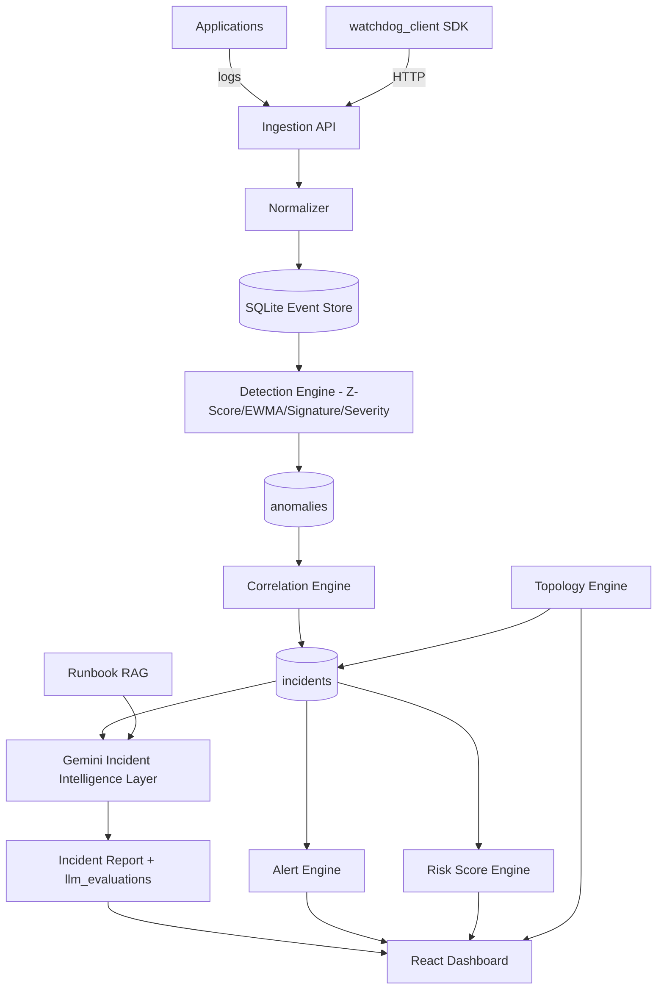
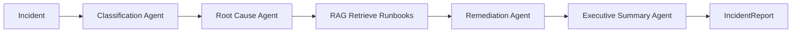

# MASTER_PLAN.md — Intelligent Observability & Event Watchdog

> Single source of truth for the Agentic Observability Platform.
> Derived from [`Intelligent Observability & Event Watchdog Doc.md`](Intelligent%20Observability%20&%20Event%20Watchdog%20Doc.md).
> Status: **Planning (no code yet)**. Owner: Samit Pawar. Version: 1.0.

---

## 1. Executive Summary

The platform is an **AI-powered SRE / observability system**. Applications stream logs to an API-first backend; the backend normalizes events, detects anomalies with deterministic statistics, correlates them into incidents, runs a 4-agent Gemini triage pipeline (classification → root cause → remediation → executive summary) augmented by runbook RAG, raises multi-channel alerts, computes a health risk score, and surfaces everything in a React dashboard. A Python SDK (`watchdog_client`) wraps the API for programmatic use.

**Core design tenets**

- **API-first**: every capability is reachable over HTTP; the dashboard and SDK are clients.
- **Deterministic where it matters**: detection and correlation are pure, testable math (NumPy). Generative AI is confined to triage.
- **Free / local-first**: SQLite database, no vector DB, Gemini free-tier only, full mock-AI fallback when `GEMINI_API_KEY` is absent.
- **TDD-graded**: the assessment reads `git log`; every behavior ships as RED → GREEN → REFACTOR with Conventional Commits.
- **Auditable AI**: every Gemini prompt is logged to `docs/llm_prompts.md` + `llm_evaluations`; every human instruction is logged to `docs/prompts.md`.

**Delivery target**: working MVP in **4–6 hours**, hard ceiling **16 hours**. The plan front-loads a thin end-to-end vertical slice, then layers intelligence.

---

## 2. Business Goals

Mapped from doc Section 1–2. The platform reduces **MTTD** (mean time to detect) and **MTTR** (mean time to resolve) by:

1. Catching issues early via statistical anomaly detection.
2. Explaining root causes quickly via agentic AI + runbook retrieval.
3. Avoiding alert fatigue via correlation, deduplication, and rate limiting.
4. Showing blast radius via a service-topology graph.
5. Giving leadership a one-glance health view via the risk score and executive summaries.
6. Being adoptable: an SDK and Docker one-liner make it usable without friction.

Success = an operator can ingest a log storm and, within seconds, see a single correlated incident with an AI root cause, recommended remediation citing a runbook, a fired alert, and an updated risk score — all on the dashboard.

---

## 3. Functional Requirements Mapping

Each requirement traces to a component, an owning module, and the phase that delivers it.

- **FR-1 Ingest single + batch logs** — Component 1 — `ingestion/ingestion_service.py`, `api/routes/events.py` — Phase 1.
- **FR-2 Validate + normalize events** — Component 2 — `ingestion/normalizer.py` — Phase 1.
- **FR-3 Event signatures** (strip dynamic values) — Component 2 — `ingestion/normalizer.py` — Phase 1.
- **FR-4 Synthetic traffic (7 scenarios)** — Component 3 — `scripts/synth/` — Phase 5.
- **FR-5 Error-rate spike detection (Z-Score, EWMA)** — Component 4 — `detection/strategies/error_rate_z_score.py`, `error_rate_ewma.py` — Phase 2.
- **FR-6 Signature-frequency detection** — Component 4 — `detection/strategies/signature_frequency.py` — Phase 2.
- **FR-7 Severity-drift detection** — Component 4 — `detection/strategies/severity_drift.py` — Phase 2 (Nice-to-have).
- **FR-8 Correlate anomalies → incidents, dedup** — Component 5 — `correlation/correlation_engine.py` — Phase 2.
- **FR-9 Service topology + blast radius** — Component 6 — `topology/topology_engine.py`, `api/routes/topology.py` — Phase 4.
- **FR-10 Incident lifecycle (status/severity)** — Component 7 — `incidents/incident_service.py`, `api/routes/incidents.py` — Phase 2.
- **FR-11 Classification Agent** — Component 8.1 — `triage/agents/classification_agent.py` — Phase 3.
- **FR-12 Root Cause Agent** — Component 8.2 — `triage/agents/root_cause_agent.py` — Phase 3.
- **FR-13 Remediation Agent (RAG-fed)** — Component 8.3 — `triage/agents/remediation_agent.py` — Phase 3.
- **FR-14 Executive Summary Agent** — Component 8.4 / 10 — `triage/agents/executive_summary_agent.py` — Phase 3.
- **FR-15 Runbook RAG (load/embed/retrieve/cite)** — Component 9 — `rag/` — Phase 3.
- **FR-16 Alert engine (dashboard/webhook/email/slack), dedup, rate-limit** — Component 11 — `alerts/` — Phase 4.
- **FR-17 Risk score (0–100)** — Component 12 — `risk/risk_score_service.py`, `api/routes/risk_score.py` — Phase 2.
- **FR-18 Dashboard (5 pages)** — Component 13 — `frontend/` — Phase 4.
- **FR-19 Health + Metrics endpoints** — Section 8 — `api/routes/health.py`, `metrics.py` — Phase 1.
- **FR-20 Python SDK** — Section 7 — `sdk/watchdog_client/` — Phase 5.
- **FR-21 AI evaluation suite** — Section 10 — `tests/ai_eval/` — Phase 3 (extended Phase 6).
- **FR-22 Prompt auditability** — Section 15 — `docs/prompts.md` (hook), `docs/llm_prompts.md` (`prompt_log.py`) — ongoing.
- **FR-23 Presentation deck** — Section 14 — `deck/` — Phase 6.

---

## 4. Non-Functional Requirements

- **Performance**: fast backend test suite (< 10s excl. `ai_eval`/`slow`); ingestion of a 1000-event batch handled in a single request.
- **Reliability**: triage never crashes a request — any agent failure falls back deterministically with `confidence = 0.0`.
- **Testability**: ≥ 90% line coverage on changed modules; LLM mocked at the `LLMClient` boundary; deterministic (seeded RNG, frozen clock, `temperature=0`).
- **Security**: secrets via env only; Pydantic validation at every boundary; request-size limits; sanitized errors; prompt-injection defenses.
- **Maintainability**: thin routes → services → repositories; one responsibility per file; SOLID; functions ≤ ~20 lines, files ≤ ~300.
- **Portability**: `docker-compose up` runs everything; clones cleanly on a fresh machine; no cloud dependency.
- **Auditability**: complete prompt history for both human instructions and Gemini calls.
- **Cost**: $0 — SQLite, local compute, Gemini free tier, mock-AI fallback.

---

## 5. System Architecture



**Layering** (enforced by `andela-fastapi-core.mdc`): Routes (thin) → Services (use cases) → Repositories (SQLAlchemy) → Models. Engines (detection, correlation, topology, triage, RAG, alerts, risk) are independent, unit-testable units composed by services. The LLM is reached only through the `LLMClient` protocol.

---

## 6. Component Architecture

The 13 components map to backend modules:

- **C1 Ingestion** — `ingestion/ingestion_service.py` + `api/routes/events.py`. Accepts single/batch, validates, normalizes, persists.
- **C2 Normalization** — `ingestion/normalizer.py`. Regex-strips dynamic tokens (numbers, UUIDs, timestamps, IPs) → stable signature; standardizes level to `LogLevel` enum.
- **C3 Synthetic Traffic** — `scripts/synth/`. CLI emitting INFO/WARN/ERROR/CRITICAL for 7 scenarios; deterministic via seed.
- **C4 Detection** — `detection/base.py` (`Detector` protocol) + one strategy per file under `detection/strategies/`. Pure functions over event windows → `Anomaly`. No magic numbers; thresholds in `core/config.py`.
- **C5 Correlation** — `correlation/correlation_engine.py`. Groups anomalies by service/time/signature affinity into one incident; dedup.
- **C6 Topology** — `topology/topology_engine.py`. Adjacency graph; BFS for blast radius; identify root service.
- **C7 Incidents** — `incidents/incident_service.py`. Lifecycle (Open/Investigating/Mitigated/Resolved), severity, persistence.
- **C8 Triage** — `triage/agents/*`. Four agents behind `LLMClient`; structured outputs; prompt logging; fallbacks.
- **C9 RAG** — `rag/runbook_loader.py`, `embedder.py`, `retriever.py`. Loads `data/runbooks/*.md`, keyword/TF-IDF retrieval, returns cited sections.
- **C10 AI Summary** — Executive Summary Agent output, aggregated into the incident report.
- **C11 Alerts** — `alerts/alert_service.py` + `channels/` (dashboard, webhook, email_sim, slack_sim). Dedup + rate limit + incident linking.
- **C12 Risk Score** — `risk/risk_score_service.py`. `100 − error − alert − incident` penalties, clamped 0–100.
- **C13 Dashboard** — `frontend/` React pages.

---

## 7. Database Design

SQLite via SQLAlchemy 2.x typed models, `Base.metadata.create_all` on startup. All timestamps timezone-aware UTC.

- **events**: `id`, `service`, `level` (enum), `message`, `signature`, `timestamp`, `hostname?`, `environment?`, `metadata?` (JSON), `created_at`.
- **anomalies**: `id`, `strategy` (z_score/ewma/signature_frequency/severity_drift), `service`, `signature?`, `score`, `baseline`, `current_value`, `window_start`, `window_end`, `created_at`, `incident_id?` (FK).
- **incidents**: `id`, `title`, `category?`, `severity` (enum), `status` (enum), `root_cause?`, `summary?`, `confidence_score?`, `risk_contribution?`, `created_at`, `resolved_at?`.
- **alerts**: `id`, `incident_id` (FK), `channel` (enum), `payload` (JSON), `dedup_key`, `status`, `created_at`.
- **runbooks**: `id`, `slug`, `title`, `path`, `content`, `keywords` (JSON), `updated_at`. (Optional table; files in `data/runbooks/` are the source of truth — table is a cache/index.)
- **metric_rollups**: `id`, `service`, `bucket_start`, `window_seconds`, `error_count`, `total_count`, `error_rate`, `level_distribution` (JSON).
- **service_topology**: `id`, `service`, `depends_on` (JSON list), `updated_at`.
- **llm_evaluations**: `id`, `incident_id?`, `agent`, `prompt_version`, `prompt`, `response`, `model`, `tokens_in`, `tokens_out`, `latency_ms`, `status`, `score?`, `expected?`, `created_at`.

Relationships: `incident 1—* anomalies`, `incident 1—* alerts`, `incident 1—* llm_evaluations`.

---

## 8. API Design

Base prefix `/api/v1` (health/metrics may also be unversioned per doc Section 8).

- `GET /health` — liveness `{status, version, ai_mode}`.
- `GET /metrics` — counts (events, incidents, alerts), current risk score.
- `POST /api/v1/events` — single event (`EventCreate` → `EventRead`), triggers detection.
- `POST /api/v1/events/batch` — up to 1000 events (`Field(max_length=1000)`).
- `GET /api/v1/events` — list/filter (service, level, since), paginated.
- `GET /api/v1/incidents` — list (filter status/severity).
- `GET /api/v1/incidents/{id}` — full incident report incl. AI analysis + runbook refs.
- `GET /api/v1/alerts` — list alerts.
- `GET /api/v1/risk-score` — current score + status band.
- `GET /api/v1/topology` — service graph + blast radius.

**Conventions**: Pydantic v2 schemas in `schemas/`; `response_model` on every route; domain exceptions mapped to HTTP via global handlers; error shape `{"detail","code"}`; 422 for validation, 404 not found, 413 over-size, 503 triage unavailable, 500 sanitized.

---

## 9. Backend Folder Structure

Authoritative layout (per `andela-fastapi-core.mdc`):

```text
backend/app/
├── main.py                      # app factory, router includes, lifespan, exception handlers
├── core/{config.py, exceptions.py, logging.py}
├── db/{base.py, session.py, init_db.py}
├── models/{event,anomaly,incident,alert,runbook,metric_rollup,service_topology,llm_evaluation}.py
├── schemas/{event,incident,alert,topology,risk}.py
├── repositories/{event,anomaly,incident,alert}_repository.py
├── ingestion/{normalizer.py, ingestion_service.py}
├── detection/{base.py, strategies/{error_rate_z_score,error_rate_ewma,signature_frequency,severity_drift}.py}
├── correlation/correlation_engine.py
├── topology/topology_engine.py
├── incidents/incident_service.py
├── triage/{llm_client.py, prompts.py, prompt_log.py, triage_service.py, agents/{classification,root_cause,remediation,executive_summary}_agent.py}
├── rag/{runbook_loader.py, embedder.py, retriever.py}
├── alerts/{alert_service.py, channels/{dashboard,webhook,email_sim,slack_sim}.py}
├── risk/risk_score_service.py
└── api/routes/{events,incidents,alerts,topology,risk_score,health,metrics}.py
```

---

## 10. Frontend Folder Structure

React 18 + Vite + TypeScript (strict) + Recharts + TanStack Query.

```text
frontend/src/
├── main.tsx, App.tsx, router.tsx
├── api/{client.ts, events.ts, incidents.ts, alerts.ts, risk.ts, topology.ts}
├── components/{RiskScoreGauge, IncidentCard, SeverityBadge, ServiceGraph, TrendChart, ...}.tsx (+ co-located *.test.tsx)
├── pages/{Overview, IncidentCenter, Topology, Trends, AIAnalysis}.tsx
├── hooks/{useIncidents.ts, useRiskScore.ts}
└── types/index.ts
```

Five pages map to Component 13: Overview, Incident Center, Topology View, Trends, AI Analysis. Tests are behavioral (RTL), no snapshots.

---

## 11. SDK Design

Package `watchdog_client` (`sdk/watchdog_client/`), independently versioned (semver).

```python
class WatchdogClient:
    def __init__(self, base_url: str, api_key: str | None = None, timeout: float = 5.0): ...
    def create_event(self, event: EventInput) -> EventResult: ...
    def create_batch(self, events: list[EventInput]) -> BatchResult: ...
    def get_incidents(self, status=None, severity=None) -> list[Incident]: ...
    def get_alerts(self) -> list[Alert]: ...
    def get_risk_score(self) -> RiskScore: ...
    def get_health(self) -> Health: ...
```

Requirements: full type hints, docstrings, usage examples, mocked-HTTP tests (`sdk/tests/`), decoupled from backend internals (its own DTOs). Built test-first per `andela-sdk-client` skill.

---

## 12. AI Layer Design

**Boundary**: services/routes never touch `google.genai` — only the `LLMClient` protocol (`complete_structured(prompt, schema, ...) -> T`). Real impl wraps Gemini 1.5 Flash with structured output (`response_schema`); `FakeLLMClient` returns canned deterministic outputs for tests; `MockAIClient` provides heuristic fallback when `USE_MOCK_AI=true` or no key.

**Pipeline** (`triage_service.py` orchestrates):



- **Structured outputs** (Pydantic) for agents 1–3: `ClassificationResponse{category}`, `RootCauseAnalysis{root_cause, confidence}`, `RemediationResponse{recommended_actions}`. Agent 4 is free text (Gemini text generation).
- **Prompt management**: all templates in `triage/prompts.py`, version-stamped (e.g. `CLASSIFICATION_PROMPT_V1`); `string.Template`/`.format`, never f-strings with user data.
- **Logging**: every call → `prompt_log.record(...)` → `llm_evaluations` row + `docs/llm_prompts.md` append (model, tokens, latency, status).
- **Failure paths**: timeout → 1 retry+backoff → `LLMTimeout`; malformed JSON → 1 retry → `LLMResponseInvalid`; rate-limit → backoff; auth → no retry. Per-incident token budget; on exhaustion/failure, deterministic fallback (`confidence=0.0`).
- **Determinism**: `temperature=0.0`, fixed model.

---

## 13. RAG Design

Doc Component 9: no vector DB required; must stay RAG-compatible.

- **Loader** (`runbook_loader.py`): read `data/runbooks/*.md` (e.g. `database_timeout.md`, `memory_leak.md`, `jwt_failure.md`, `disk_full.md`), split into sections, extract keywords/title.
- **Embedder** (`embedder.py`): deterministic offline representation — TF-IDF / keyword bag (no network). Pluggable interface so a real embedding model can drop in later.
- **Retriever** (`retriever.py`): score incident signal (category + signatures + root cause) against runbook sections; return top-k with **citations** (`runbook slug + section`).
- **Injection**: retrieved sections wrapped in delimited blocks and fed to the Remediation Agent prompt. Citations surface on the AI Analysis page and in the incident report.

Abstraction boundary (`Retriever` protocol) keeps the AI workflow unchanged if retrieval is later swapped for Vertex AI Search / Pinecone / Qdrant.

---

## 14. Testing Strategy

Per `andela-tdd-discipline.mdc` + `andela-testing.mdc`. **TDD is mandatory**: RED → GREEN → REFACTOR, one behavior per commit.

- **Unit** (default, < 10ms): normalization, each detector, correlation, risk score, topology, agent prompt-construction/parsing/fallback, RAG retrieval.
- **Integration** (< 500ms): events/incidents/alerts/topology/risk APIs via `TestClient` over in-memory SQLite; ingest → detect → correlate → incident pipeline.
- **AI evaluation** (`tests/ai_eval/`, `@pytest.mark.ai_eval`): fixtures in `tests/ai_eval/fixtures/*.json`; measure classification accuracy, root-cause accuracy, remediation quality, summary quality against thresholds; results to `llm_evaluations`; report `artifacts/ai_evaluations.md`. Never calls live Gemini.
- **SDK** (`sdk/tests/`): mocked HTTP.
- **Frontend**: Vitest + RTL, behavioral, co-located.
- **Fixtures** (`tests/conftest.py`): `engine`, `db`, `fake_llm`, `client`. Determinism: seeded RNG, frozen clock, `temperature=0`, `pytest-randomly`.
- **Coverage**: ≥ 90% on changed modules — `pytest --cov=backend/app --cov-report=term-missing`.

---

## 15. Docker Strategy

Per doc Section 12.

- **backend**: multi-stage build, non-root user, `uvicorn backend.app.main:app`; env-injected secrets.
- **frontend**: Vite build served via static server; proxies `/api` to backend.
- **db**: SQLite as a mounted volume (no separate container process needed; volume persists `var/watchdog.db`).
- `docker-compose.yml` wires services; `docker-compose up` / `down`. `.dockerignore` excludes tests, node_modules, `.env`.

---

## 16. CI/CD Strategy

GitHub Actions (`infra/` / `.github/workflows/`), pipeline fails on any violation. Stages (doc Section 11):

1. **Ruff** (lint) → 2. **Black --check** (format) → 3. **Mypy** (types) → 4. **Pytest** (`-m "not ai_eval and not slow"` + coverage gate).

Separate job for `ai_eval` (recorded/fake LLM). Frontend job: `npm ci` → `vitest --run`. Optional `pip-audit`. Identity for any push: GitHub account `samit9495` (no local git config edits).

---

## 17. Security Strategy

Per `andela-security.mdc` + doc Section 9.

- **Secrets**: env only (`pydantic-settings`); `.env.example` with placeholders; `.env`/keys gitignored.
- **Input validation**: Pydantic at every boundary — `max_length` on strings (message ≤ 4000), range limits, enums, batch ≤ 1000, reject naive datetimes.
- **Request limits**: body-size cap (413 on exceed).
- **Error sanitization**: `{"detail","code"}` only; no stack traces/SQL/paths; 500 = generic.
- **PII-safe logging**: log `service/level/signature/event_id`, not raw messages; redact.
- **Prompt injection**: sanitize event messages (strip control chars + injection markers), truncate, wrap in `<<<INPUT>>>…<<<END>>>`, system prompt declares input is data; structured-output validation is the backstop.
- **Outbound**: webhook URLs from config (not user data), timeouts, host allow-list (SSRF guard).
- **SQL**: ORM/parameterized only, no f-string SQL.

---

## 18. Risk Mitigation

- **Gemini quota / no key** → mock-AI fallback + `FakeLLMClient`; demo works offline.
- **TDD discipline slips under time pressure** → keep cycles tiny; commit `test:` before `feat:`; the milestone checklist tracks it.
- **Scope creep (16 components)** → strict MVP/Nice/Stretch split (Section 21); build vertical slice first.
- **Flaky AI tests** → determinism rules; AI eval isolated from the fast loop.
- **Correlation over/under-grouping** → tune via config thresholds, covered by unit fixtures.
- **Frontend time sink** → minimal but clean pages; mock data wired to real endpoints early.
- **Coverage gate blocking CI** → write tests first (TDD makes 90% a byproduct, not a chore).
- **Time overrun** → MVP defined to be demoable by Phase 4; Phases 5–6 are enhancement/polish.

---

## 19. Demo Strategy

1. `docker-compose up` (or `uvicorn` + `npm run dev`).
2. Run synthetic generator: `python -m scripts.synth.cli db_outage --duration 120 --seed 42`.
3. Show Overview: risk score drops Healthy → Critical; active incidents/alerts climb.
4. Open Incident Center: a single correlated "Database Degradation" incident (not a storm).
5. AI Analysis page: category=Database, root cause=pool exhaustion w/ confidence, remediation actions citing `database_timeout.md`, executive summary narrative.
6. Topology: highlight root service + blast radius across downstream services.
7. Trends: error-rate spike + incident timeline + severity drift.
8. Show an alert payload (webhook sim) and the SDK ingesting an event in a REPL.
9. Show `docs/prompts.md` + `docs/llm_prompts.md` for auditability; show green CI.

Fallback: if no Gemini key, set `USE_MOCK_AI=true` — identical flow with heuristic AI.

---

## 20. Implementation Phases

Each phase is a sequence of RED→GREEN→REFACTOR cycles with Conventional Commits.

### Phase 0 — Project Skeleton & Tooling
- **Objective**: runnable FastAPI app, config, DB session, tooling, CI, base test fixtures.
- **Deliverables**: `pyproject.toml` (deps + ruff/black/mypy/pytest config), `core/config.py`, `db/base.py`/`session.py`/`init_db.py`, `main.py` with `GET /health`, `tests/conftest.py`, GitHub Actions workflow, `.env.example`, `.gitignore`.
- **Dependencies**: none.
- **Estimated effort**: 0.75 h.
- **Acceptance**: `uvicorn` boots; `GET /health` 200; `pytest` green; CI runs.
- **Risks**: tooling config churn — mitigate by copying canonical configs.

### Phase 1 — Ingestion + Normalization (vertical slice start)
- **Objective**: ingest, validate, normalize, persist, list events.
- **Deliverables**: `Event` model + schemas + repository; `normalizer.py`; `ingestion_service.py`; `events.py` routes (single/batch/list); `GET /metrics`.
- **Dependencies**: Phase 0.
- **Estimated effort**: 1.0 h.
- **Acceptance**: POST single + batch persist with signatures; GET filters; batch > 1000 → 422; coverage ≥ 90% on touched modules.
- **Risks**: signature regex over-stripping — covered by fixtures incl. unicode.

### Phase 2 — Detection + Correlation + Incidents + Risk (MVP core)
- **Objective**: turn events into anomalies → incidents, compute risk.
- **Deliverables**: `Detector` protocol; Z-Score, EWMA, signature-frequency strategies; `Anomaly`/`Incident` models, schemas, repositories; `correlation_engine.py`; `incident_service.py`; incidents routes; `risk_score_service.py` + route.
- **Dependencies**: Phase 1.
- **Estimated effort**: 1.5 h.
- **Acceptance**: known baseline+spike fixture flags anomaly; related anomalies → one incident (dedup); `GET /incidents`, `/incidents/{id}`, `/risk-score` work; risk clamped 0–100.
- **Risks**: threshold tuning, division-by-zero on empty windows — guard + test.

### Phase 3 — Agentic Triage + RAG (the headline)
- **Objective**: AI incident report with runbook-cited remediation.
- **Deliverables**: `LLMClient` protocol + Gemini impl + `FakeLLMClient`/mock; `prompts.py`; `prompt_log.py`; 4 agents; `triage_service.py`; RAG loader/embedder/retriever; seed runbooks in `data/runbooks/`; `llm_evaluations` model; first `tests/ai_eval/` fixtures.
- **Dependencies**: Phase 2.
- **Estimated effort**: 1.75 h.
- **Acceptance**: incident triage returns category/root_cause/remediation/summary; remediation cites a runbook; every call logged to `llm_evaluations` + `docs/llm_prompts.md`; agent failure falls back (confidence 0.0); AI eval thresholds met on fixtures.
- **Risks**: Gemini quota/latency — mock fallback; prompt-injection — sanitize + delimiters.

### Phase 4 — Alerts + Topology + Dashboard (MVP demoable)
- **Objective**: alerts, blast radius, and a working UI.
- **Deliverables**: alert service + 4 channels (dedup/rate-limit/linking); `topology_engine.py` + route + `service_topology` seed; React app with 5 pages wired to real endpoints.
- **Dependencies**: Phases 2–3.
- **Estimated effort**: 2.0 h.
- **Acceptance**: incident raises a (simulated) webhook alert; `/alerts`, `/topology` work; dashboard shows risk, incidents, topology, trends, AI analysis from live API.
- **Risks**: frontend time sink — keep components minimal, behavioral tests only.

### Phase 5 — SDK + Synthetic Traffic
- **Objective**: programmatic client + demo data.
- **Deliverables**: `watchdog_client` (6 methods, typed, mocked tests, semver); `scripts/synth/` CLI with 7 scenarios.
- **Dependencies**: Phase 1+ (events API), Phase 4 (read APIs).
- **Estimated effort**: 1.0 h.
- **Acceptance**: SDK methods round-trip against the API; `db_outage` scenario produces a correlated incident end-to-end.
- **Risks**: SDK/backend coupling — keep SDK DTOs independent.

### Phase 6 — Hardening, AI Eval Expansion, Docker, Deck
- **Objective**: production-grade polish + assessment artifacts.
- **Deliverables**: Dockerfiles + `docker-compose.yml`; expanded AI eval suite + `artifacts/ai_evaluations.md`; security pass (`SEC:`); README; presentation deck (11 slides); coverage report.
- **Dependencies**: all prior.
- **Estimated effort**: 1.5 h.
- **Acceptance**: `docker-compose up` runs full stack; CI green incl. coverage gate; deck present; all doc Section 15 criteria checked.
- **Risks**: Docker/SQLite volume permissions — non-root + volume tested locally.

**Total estimate**: ~9.5 h full build; **demoable MVP at end of Phase 4 (~7 h)**, within the 16 h ceiling. The 4–6 h "MVP" target is met by the reduced MVP scope in Section 21 (Phases 0–3 + minimal dashboard).

---

## 21. MVP / Nice-to-Have / Stretch Features

**MVP (must ship for a working demo, ~4–6 h)**
- Ingestion single + batch + list (C1/C2).
- Z-Score + signature-frequency detection (C4).
- Correlation → incidents + dedup (C5).
- Incident lifecycle + incidents API (C7).
- Risk score + endpoint (C12).
- 4-agent triage with **mock-AI fallback** + minimal RAG keyword retrieval (C8/C9/C10).
- Health + metrics endpoints (Section 8).
- Minimal dashboard: Overview + Incident Center + AI Analysis (C13 subset).
- Prompt audit logging (Section 15).

**Nice-to-Have**
- EWMA + severity-drift detection (C4).
- Topology engine + Topology view + blast radius (C6).
- Full alert engine with all 4 channels + rate limiting (C11).
- Trends page (C13).
- Python SDK (C7 doc) + synthetic traffic generator (C3).
- AI evaluation suite with scored fixtures (Section 10).
- Real Gemini integration (beyond mock).

**Stretch**
- Docker multi-stage + Compose full stack (still a doc requirement, but after demo).
- TF-IDF/embedding-based RAG (beyond keyword), pluggable for vector DBs.
- WebSocket live dashboard updates.
- Auth (API key) + per-key rate limiting.
- Richer topology auto-discovery from event metadata.

---

## 22. Mock vs Fully Implemented (initial recommendation)

**Mock / fake first**
- **Gemini calls** — `FakeLLMClient` in tests, `MockAIClient` heuristic at runtime (`USE_MOCK_AI`). Real Gemini wired but optional for the demo.
- **Alert channels** — webhook/email/slack are *simulated* by design (log + persist payload), not real integrations.
- **RAG embedder** — deterministic keyword/TF-IDF, not a hosted embedding API.
- **Service topology** — seeded from a static JSON config initially, not auto-discovered.

**Fully implemented from the start (do NOT mock — this is the assessed substance)**
- Ingestion + normalization + persistence.
- Detection math (Z-Score, EWMA, signature, severity) — real NumPy.
- Correlation + dedup.
- Incident lifecycle + risk score.
- Repositories over real (in-memory for tests) SQLite.
- Prompt logging + `llm_evaluations`.
- The `LLMClient` protocol + agent orchestration + structured-output validation + fallbacks (the *workflow* is real even when the model is faked).

---

## 23. Ambiguities & Missing Requirements (flagged for resolution)

1. **API path versioning**: doc Section 8 lists unversioned paths (`/events`), but Component 1 uses `/api/v1/events`. **Assumption**: implement `/api/v1/*` and alias `/health`, `/metrics` unversioned. *Confirm.*
2. **Correlation algorithm** — **RESOLVED** (see Section 26).
3. **Detection thresholds** — **RESOLVED** (see Section 26).
4. **Risk score penalty weights** — **RESOLVED** (see Section 26).
5. **Severity assignment**: how incident severity is derived (from anomaly score? category? blast radius?) is unspecified. **Assumption**: rule-based from max anomaly score + affected-service count.
6. **Topology source**: provided via config/API vs derived from events? **Assumption**: seeded JSON + `GET /topology`; no write endpoint in MVP.
7. **AI evaluation scoring method** ("scored against expected outputs") — exact metric/threshold undefined. **Assumption**: category exact-match accuracy, root-cause keyword overlap, remediation rubric (action verbs + subsystem), summary keyword coverage; thresholds documented (e.g. ≥ 80%).
8. **Runbook set**: doc lists 4 examples; final list unspecified. **Assumption**: ship those 4 + a couple more to cover scenarios.
9. **Metrics endpoint contents** undefined. **Assumption**: counts + current risk score (Prometheus format not required unless requested).
10. **`prompts.md` duplication**: root `prompts.md` (human instructions, hook) vs `docs/llm_prompts.md` (Gemini). Doc says "prompts.md contains complete prompt history" — **both** are maintained to satisfy it.
11. **Auth**: doc Section 9 omits authN/Z. **Assumption**: none for MVP; structure allows adding `X-API-Key` later.
12. **Frontend↔backend serving** in Docker (proxy vs separate origin + CORS). **Assumption**: Compose with backend CORS allowing the frontend origin.

---

## 24. Implementation Order (MVP-optimized)

Front-load a thin end-to-end slice, then deepen:

1. Phase 0 skeleton + `/health` + CI.
2. Phase 1 ingestion (events flow into DB).
3. Phase 2 detection → correlation → incident → risk (the analytical core).
4. Phase 3 triage + RAG (mock-AI first so it's demoable without a key; wire real Gemini after).
5. Minimal dashboard (Overview + Incident Center + AI Analysis) — **MVP demoable here**.
6. Phase 4 remainder: alerts, topology, Trends page.
7. Phase 5 SDK + synthetic traffic (enables a scripted demo).
8. Phase 6 Docker, AI-eval expansion, security pass, README, deck.

Rationale: every step keeps the suite green and the app runnable; the demo-critical path (ingest → incident → AI report → dashboard) is complete before any "nice-to-have" work begins.

---

## 25. Milestone Checklist

**M0 — Skeleton** ✅ (Phase 0 complete)
- [x] `pyproject.toml` + tooling (ruff/black/mypy/pytest) configured
- [x] App boots; `GET /health` 200
- [x] `tests/conftest.py` fixtures; first test green (21 tests, 100% coverage)
- [x] GitHub Actions pipeline runs (ruff→black→mypy→pytest)

**M1 — Ingestion** ✅ (Phase 1 complete)
- [x] `POST /api/v1/events` (single) persists normalized event
- [x] `POST /api/v1/events/batch` (≤ 1000) persists; > 1000 → 422; empty → 422
- [x] `GET /api/v1/events` filters (service/level/since) + paginates; zero → `[]`
- [x] `GET /metrics` returns counts (total, by-level, monitored services)
- [x] Coverage 100% on ingestion modules (71 tests total)

**M2 — Detection/Correlation/Incidents/Risk** ✅ (Phase 2 complete)
- [x] Z-Score detector flags anomaly on fixture
- [x] Signature-frequency detector flags burst
- [x] EWMA detector flags drift (severity-drift deferred — Nice-to-have)
- [x] Anomalies correlate into a single incident (dedup + window absorption)
- [x] `GET /api/v1/incidents`, `/incidents/{id}` work (404 on missing)
- [x] Risk score computed + `/api/v1/risk-score`, clamped 0–100 with bands
- [x] Coverage 98% (105 tests total); HTTP auto-trigger deferred to Phase 4 (pipeline)

**M3 — Triage + RAG**
- [ ] `LLMClient` protocol + Gemini impl + Fake/Mock
- [ ] 4 agents produce structured outputs (+ exec summary)
- [ ] RAG retrieves + cites a runbook into remediation
- [ ] Every call logged to `llm_evaluations` + `docs/llm_prompts.md`
- [ ] Agent failure falls back (confidence 0.0)
- [ ] AI eval fixtures pass thresholds

**M4 — Alerts + Topology + Dashboard**
- [ ] Incident raises simulated webhook alert (dedup + rate-limit)
- [ ] `GET /alerts`, `GET /topology` (blast radius) work
- [ ] Dashboard Overview + Incident Center + AI Analysis render live data
- [ ] (Nice) Topology view + Trends page

**M5 — SDK + Synthetic Traffic**
- [ ] `watchdog_client` 6 methods, typed, mocked tests, semver
- [ ] Synthetic generator: 7 scenarios, deterministic
- [ ] `db_outage` scenario produces a correlated incident end-to-end

**M6 — Hardening + Delivery**
- [ ] `docker-compose up` runs full stack
- [ ] Security pass (secrets, validation, sanitization, prompt-injection)
- [ ] CI green incl. coverage gate
- [ ] README complete; deck (11 slides) present
- [ ] All doc Section 15 acceptance criteria checked

**Doc Section 15 acceptance (final gate)**
- [ ] Logs ingested
- [ ] Anomalies detected
- [ ] Anomalies correlated into incidents
- [ ] AI triage structured outputs
- [ ] Runbooks influence AI responses
- [ ] Alerts generated
- [ ] Dashboard visualizes health trends
- [ ] Risk score calculated
- [ ] SDK functions
- [ ] CI passes
- [ ] Docker deployment works
- [ ] `prompts.md` complete
- [ ] Deck available

---

## 26. Resolved Configuration Constants

Confirmed with stakeholder; all live in `backend/app/core/config.py` (no magic numbers).

### 26.1 Correlation algorithm
- `CORRELATION_WINDOW_SECONDS = 300` — sliding window for grouping anomalies.
- Two anomalies merge into one incident if same window **AND** related by: same `service`, **or** topology-adjacent service, **or** signatures in the same category cluster (e.g. `Database timeout` + `Connection refused` + `Pool exhausted`).
- An **open** incident absorbs new correlated anomalies (no duplicate incidents).
- Dedup: same `(service, signature)` within the window contributes once.

### 26.2 Detection thresholds
- **Z-Score**: `ANOMALY_Z_SCORE_THRESHOLD = 3.0`; `MIN_BASELINE_SAMPLES = 10`; 60s buckets.
- **EWMA**: `EWMA_ALPHA = 0.3`; flag when deviation > `3 ×` EWMA stddev.
- **Signature frequency**: flag when current rate ≥ `max(SIGNATURE_BURST_MULTIPLIER × baseline, SIGNATURE_BURST_FLOOR)` with `SIGNATURE_BURST_MULTIPLIER = 5`, `SIGNATURE_BURST_FLOOR = 10` (per minute).
- **Severity drift**: flag when (ERROR+CRITICAL) share rises ≥ `SEVERITY_DRIFT_DELTA = 0.25` vs baseline; `MIN_SEVERITY_SAMPLES = 20`.

### 26.3 Risk score weights
`Risk = 100 − error_penalty − alert_penalty − incident_penalty`, clamped to `[0, 100]`:
- `error_penalty = min(40, error_rate_pct × 0.8)` — `error_rate_pct` = % of window events at ERROR/CRITICAL.
- `alert_penalty = min(30, open_alerts × 5)`.
- `incident_penalty = min(50, Σ severity_weight)` with `Critical = 20, High = 12, Medium = 6, Low = 2`.
- Bands: `90–100` Healthy, `70–89` Warning, `0–69` Critical.
